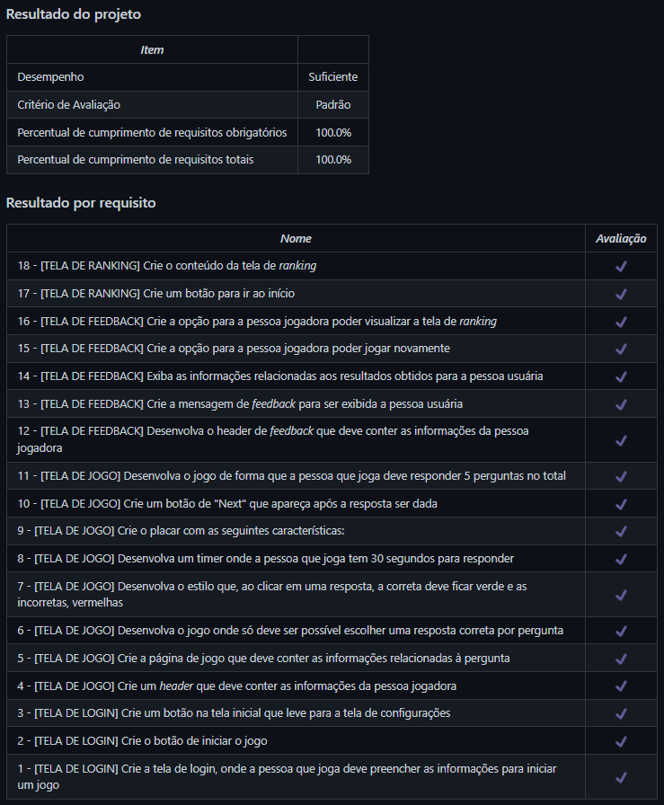

# Trivia React Redux
Projeto da [Trybe](https://www.betrybe.com/) - Bloco 16 - Aplicação de jogo de Trivia feita com React e Redux.

## 💻 Projeto

Jogo de perguntas e respostas utilizando React e Redux, no qual a pessoa usuária poderá:

- Logar no jogo e, se o email tiver cadastro no site [Gravatar](https://pt.gravatar.com), ter sua foto associada ao perfil da pessoa usuária.
- Acessar a página do jogo, onde se deverá escolher uma resposta para cada perguntas. A resposta deve ser marcada antes do contador de tempo chegar a zero, caso contrário a resposta será considerada errada.
- Ser redirecionada, após 5 perguntas respondidas, para a tela de score, onde o texto mostrado depende do número de acertos.
- Visualizar a página de ranking, se quiser, ao final de cada jogo.
- Configurar opções para o jogo em uma tela de configuração acessível a partir do cabeçalho do app.

<details>
  <summary><strong>🏆 Meu desempenho</strong></summary><br />

  
</details>

## 🚀 Tecnologias
> Este projeto foi desenvolvido com as seguintes tecnologias:

- JavaScript
- React
- Redux
- Material UI

## 📌 Habilidades

> Neste projeto, desenvolvi as seguintes habilidades:

- Criar um store, reducers, actions e dispatchers no Redux em aplicações React;
- Conectar Redux aos componentes React;
- Criar actions assíncronas em uma aplicação React que faz uso de Redux;
- Estilizar componentes React com a biblioteca Material UI.

## ⬇️ Instalando dependências

```bash
npm install
``` 

## ⚡ Executando a aplicação

```bash
npm start
``` 

## 🧪 Executando os testes

```bash
npm test
```

## 👨‍💻👩‍💻 Contribuintes
<div>
    <table>
        <tr>
            <td align="center"><a href="https://github.com/julianoboese"><br /><b>Juliano Boese</b></a></td>
            <td align="center"><a href="https://github.com/c-swame"><br /><b>Caio Swame</b></a></td>
            <td align="center"><a href="https://github.com/joseviniciusb"><br /><b>Zé</b></a></td>
        </tr>
    </table>
</div>

## 💬 Contatos

<div align="center" style="display: inline_block">
  <a href="https://julianoboese.github.io" target="_blank"></a> 
  <a href="https://www.linkedin.com/in/julianoboese" target="_blank"></a> 
  <a href = "mailto:juliano.boese@gmail.com"></a>
</div>

<!-- ## 📄 Licença

Esse projeto está sob licença. Veja o arquivo [LICENÇA](LICENSE.md) para mais detalhes.

[⬆ Voltar ao topo](#nome-do-projeto)<br> -->
